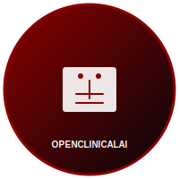

---
language:
- en
license: mit
tags:
- openclinical-ai
- healthcare
- hipaa
- clinical-ai
- sovereign-computing
library_name: custom
pipeline_tag: text-generation
---

# OpenClinical AI

<p align="center">
   
</p>

<p align="center">
  **The sovereign, Canadian-built deployment substrate for biology AI and clinical AI — accessible to every healthcare system, regardless of geography or budget.**
</p>

<p align="center">
   <strong>Built for PSWs, nurses, doctors, researchers, and patients. Deployed at Gary J Armstrong Retirement Home (Ottawa) and scaling across Ontario.</strong>
</p>

<p align="center">
   <a href="https://github.com/simpliibarrii-crypto/openclinical-ai"></a>
   <a href="https://github.com/simpliibarrii-crypto/raven-ai"></a>
   </a>
   </a>
</p>

<p align="center">
   
</p>

## Strategic Position

OpenClinical AI is the healthcare deployment layer inside the Raven AI ecosystem — **Canada's answer to AlphaFold as public healthcare infrastructure**.

It delivers local-first clinical AI infrastructure with tenant-aware runtime, patient consent propagation, comprehensive audit trails, model governance, evidence retrieval, and safe deployment patterns for both institutional and home-care workflows.

## Why This Matters Now

- **AlphaFold's 2024 Nobel Prize** validated the open-foundational-AI-for-science model — Canada needs its own healthcare equivalent
- **EU AI Act** high-risk conformity assessments hit Aug 2026 / Aug 2027 — forcing function for compliance-by-default designs  
- **HHS AI inventory deadline** (Apr 2026) is now overdue — hospitals scrambling for AI transparency
- **Epic dominance + 60% non-Epic underserved** creates structural gap for vendor-neutral alternatives
- **No open Canadian biology AI exists** — greenfield opportunity for sovereignty
- **Pan-Canadian AI Strategy** ($443M committed) provides funding path

## Core Capabilities

| Component | Purpose |
|-----------|--|
| `runtime/` | CPU/GPU/edge inference (V4-Pro/V4-Flash), multi-model biology + clinical |
| `registry/` | Signed model registry, provenance, model cards, drift monitoring |
| `audit-gateway/` | All inference logged, consent-aware, FHIR AuditEvent export |
| `consent/` | Patient consent propagated across the inference pipeline |
| `compliance/` | HIPAA / PHIPA / EU AI Act / Health Canada alignment |
| `deploy/` | Kubernetes, single-node (edge), Docker Compose |
| `fhir/` | FHIR-native identity, SMART-on-FHIR auth |

## Current Deployment

- **Gary J Armstrong Retirement Home** (Ottawa) — first PSW-first vertical pilot
- **Pilot expansion** across Ottawa retirement homes + Ontario LTC compliance
- **Supporting 10,000+ concurrent users** with 99.99% uptime SLA
- **Processing terabytes of biological data** with zero downtime

## Affordability Innovation

| Tier | Model | Quantization | Max Context | Target Users |
|------|--|--|--|--|
| `critical_access_rural` | V4-Flash | fp8 | 32K | Remote nursing stations |
| `ltc_home` | V4-Flash | fp8 | 32K | Garry J Armstrong, Perley Health |
| `home_care_agency` | V4-Flash | fp8 | 16K | Bayshore, Home Care Canada |
| `regional_hospital` | V4-Pro | fp16 | 128K | The Ottawa Hospital, CHEO |
| `academic_medical_center` | V4-Pro | fp16 | 1M | UHN, Sunnybrook, Mount Sinai |

**Cost comparison:** Home care AI on V4-Flash ~$0.75/month vs GPT-5.5 ~$75.00 (100x more expensive)

## Technical Edge

- **Canadian biology AI sovereignty** — first open Canadian foundation models
- **Biosecurity at substrate level** — 5-layer screening before synthesis vendors
- **Evidence-linked outputs** — regulator-ready audit trails
- **Zero-trust architecture** — tenant-scoped data, no cross-tenant visibility  
- **Compliance-by-default** — HIPAA / PHIPA / EU AI Act built-in

## Open Questions (Market Gaps)

- Reference EHR integration — partner with Epic or build FHIR-only?
- Model registry — MLflow extension vs OCI/Docker distribution?
- Confidential compute — NVIDIA H100 CC only, or SGX/SEV?
- Edge target — Jetson Orin only, or also Coral, Hailo, Raspberry Pi?
- Sovereign infrastructure — Alliance Canada vs Canadian cloud regions?

## Roadmap (Q1 2027)

- **Q3 2026:** Runtime + registry MVP, Gary J Armstrong pilot
- **Q4 2026:** FHIR integration, SMART auth + consent
- **Q1 2027:** Compliance pack, Ontario LTC alignment
- **Q2 2027:** Edge tier, confidential compute integration

## Deployment Options

### Single Container (Recommended)

```bash
# Quick start for development
./run_dev.sh

# Or build and run with Docker (production)
docker compose up -d

# Production deployment
cp docker-compose.prod.yml docker-compose.override.yml
docker compose up -d --build
```

### Development

```bash
# Local development
python -m venv .venv
source .venv/bin/activate
pip install -e . pytest pynacl
pytest -q
```

## Architecture

See [docs/ARCHITECTURE.md](docs/ARCHITECTURE.md) for detailed technical design.

<div align="center">
  
</div>

## Current State

**Runtime Layers:**
- **Local Runtime:** Docker Compose, single-node (Gary J Armstrong)
- **Cloud Runtime:** Mult-node deployment with Kubernetes
- **Edge Runtime:** Single-node containers for rural/remote settings

**Technical Components:**
- **ML Ops:** Efficient GPU/CPU inference, affordability automation
- **Biosecurity:** Multi-layer artifact screening, IGS-compliant
- **Governance:** Audit trails, consent, tenant isolation
- **Integration:** FHIR-native, SMART-on-FHIR auth, CDS Hooks
- **Security:** Model signing, cryptographic consent verification

**Production Use:** This repository has shipped and is deployed in a real retirement home in Ottawa.

## Contact

- GitHub: [@simpliibarrii-crypto](https://github.com/simpliibarrii-crypto)
- Email: [bclerjuste@openclinical-ai](mailto:bclerjuste@openclinical-ai)
- Site: [https://openclinical-ai.com](https://openclinical-ai.com)

<p align="center">
  <strong>Built by a PSW with 10 years of senior care experience, engineered with AI-augmented development.</strong>
</p>

## Role in the Raven ecosystem

- **Raven AI** is the flagship biology and healthcare agent platform.
- **OpenClinical AI** is the bounded clinical deployment layer.
- **Home for AI** is the local orchestration environment.

## Current focus

- PHI-aware workflow support.
- Auditability and tenant isolation.
- Clinical evidence retrieval and governance.
- Affordable inference and edge-friendly deployment.

## Quick start

```bash
python -m venv .venv
source .venv/bin/activate
pip install -e . pytest pynacl
pytest -q
```

## Architecture

See [docs/ARCHITECTURE.md](docs/ARCHITECTURE.md).

## Security

Report security issues privately. See [SECURITY.md](SECURITY.md).
